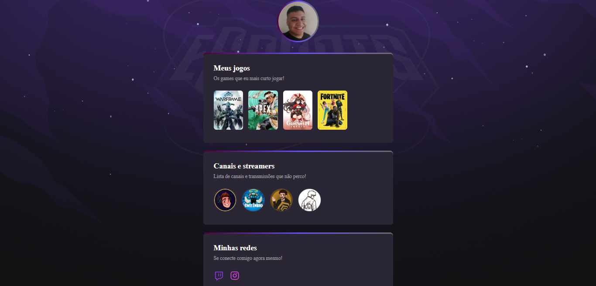

# NLW eSports 

> Trilha Explorer

Projeto constuido do evento Next Level Week da Rocketseat mostrando os jogos e streamers que eu acompanho.

[ 🔗 Clique aqui agora para acesar](https://mrsulyvahn.github.io/nlw-esports-explorer/)

## 🔨 Tecnologias

- HTML
- CSS
- Git e Github

##  📖 O que eu aprendi

Aprendi com HTML e CSS a como criar uma página e nela conter imagens, links clicavéis, bordas, animação e tags. O aprendizado nesse evento foi muito bom e será aplicado em projetos futuros! 

##  ✉️ Contato

joaovnerydurval@hotmai.com